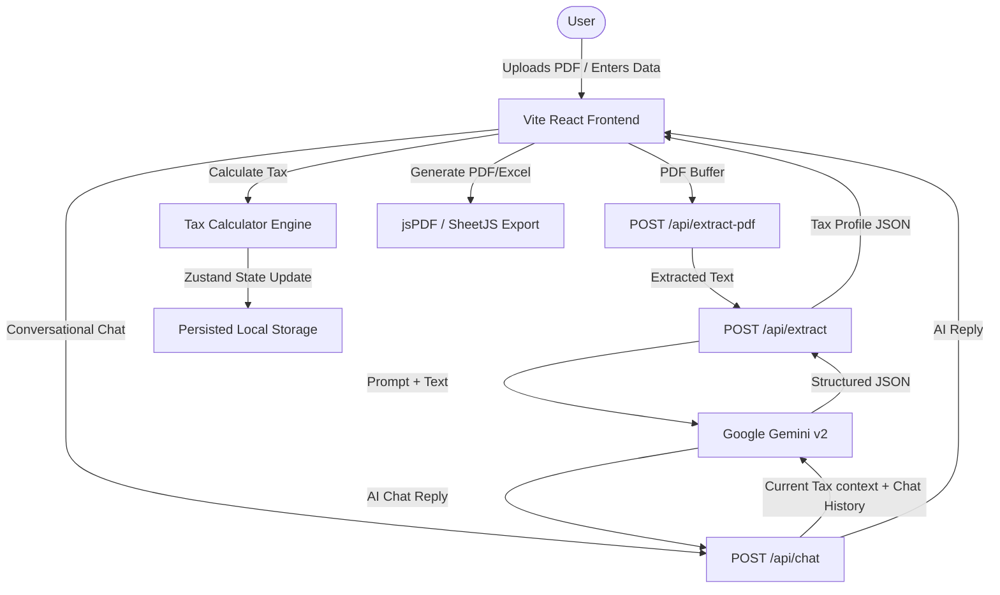

# 📊 TaxSense — The ITR Filing Copilot

[](https://react.dev)
[](https://vite.dev)
[](https://tailwindcss.com)
[](https://ai.google.dev/)
[](https://www.typescriptlang.org/)
[](https://opensource.org/licenses/MIT)

**TaxSense** is an AI-powered, conversational web application that helps salaried individuals in India understand, optimize, and prepare their Income Tax Return (ITR-1 Sahaj / ITR-2) filing for **Assessment Year (AY) 2026-27 (Financial Year 2025-26)**.

---

## 🚀 Key Features

*   **💬 AI Chat Copilot** – Conversational interface powered by Google Gemini that answers tax queries, explains deduction limits, and guides data entry.
*   **📄 Form 16 Import** – Seamlessly upload Form 16 PDFs. The backend extracts text using `pdf-parse`, and Gemini automatically maps income and TDS figures to a structured tax profile.
*   **⚖️ Old vs New Regime Comparison** – Real-time side-by-side comparison of tax calculations, showing exactly how much tax is owed or due for refund under each regime, complete with rebate calculations u/s 87A.
*   **💡 Deduction Optimizer** – Detailed sliders and cards for 15+ sections of the Income Tax Act (80C, 80D, 80CCD(1B), 80CCD(2), 80DD, 80U, 80E, 80G, etc.) with inline help.
*   **📈 Capital Gains Support** – Supports Short-Term Capital Gains (STCG at 20%) and Long-Term Capital Gains (LTCG at 12.5% after ₹1.25L exemption) and automatically flags when ITR-2 filing is required.
*   **📰 Finance News Ticker** – A scrolling live financial news ticker powered by Gemini, producing updated tax and policy briefs.
*   **🔄 Portfolio Sync Simulation** – Link investment profiles to simulate stock and mutual fund capital gains import.
*   **💾 Persistent State** – Remembers user data across page refreshes by leveraging Zustand state management with local storage hydration.
*   **📤 Professional Export** – Download a clean tax summary PDF (via `jsPDF`) or an Excel spreadsheet (via SheetJS `xlsx`).

---

## 🛠️ Tech Stack

### Frontend
- **React 19 & TypeScript** – Modern UI components and strict typing.
- **Vite 6** – Fast building and Hot Module Replacement (HMR).
- **Tailwind CSS 4 & Motion (Framer Motion v12)** – Fluid animations and clean design.
- **Zustand 5** – Fast, lightweight, and persisted global state management.
- **Recharts 3** – Elegant tax slab & comparison charts.

### Backend
- **Express 4** (run via `tsx` TypeScript executor) – Server routing and API management.
- **Google Gemini SDK (`@google/genai` v2)** – For high-fidelity document parsing, financial recommendations, and news generation.
- **PDF-Parse** – Memory-efficient server-side PDF text extraction.

---

## 📐 Architecture & Data Flow



---

## ⚡ Quick Start

### 📋 Prerequisites
- **Node.js** (v18.x or above)
- **NPM** or **Yarn**
- A **Gemini API Key** from [Google AI Studio](https://aistudio.google.com/)

### 🔧 Installation

1. Clone the repository and navigate into it:
   ```bash
   cd TAXSENSE
   ```

2. Install the dependencies:
   ```bash
   npm install
   ```

3. Set up the environment variables:
   ```bash
   cp .env.example .env
   ```
   Open the `.env` file and enter your Gemini API Key:
   ```env
   GEMINI_API_KEY="your-gemini-api-key-here"
   APP_URL="http://localhost:3000"
   ```

### 🏃 Running locally

To start the server and the Vite dev build (concurrently run via Express server setup):
```bash
npm run dev
```
Open your browser and visit: [http://localhost:3000](http://localhost:3000)

### 📦 Building for Production

Compile both the frontend assets and the Express backend:
```bash
npm run build
```

Launch the production server:
```bash
npm start
```

---

## 🔌 API Documentation

| Endpoint | Method | Description | Payload Schema / Response |
| :--- | :--- | :--- | :--- |
| `/api/health` | `GET` | Health Check endpoint | Returns server status and timestamp. |
| `/api/finance-news` | `GET` | Gemini-generated dynamic finance news | Returns 6 curated news bulletins for FY 2025-26. |
| `/api/extract-pdf` | `POST` | Upload Form 16 PDF file | Form-data file upload. Returns extracted raw text. |
| `/api/extract` | `POST` | JSON payload of raw text from Form 16 | Extracts tax profile properties (`grossSalary`, `deduction80C`, `hraExemption`, etc.) using Gemini. |
| `/api/chat` | `POST` | Dialog interaction with Copilot | Accepts `messages` and the user's `taxData` JSON context. Returns Gemini's personalized tax suggestions. |

---

## 🧮 Indian Tax Slabs (AY 2026-27 / FY 2025-26)

### 🆕 New Tax Regime Slabs (Default)
Standard Deduction: **₹75,000** (Budget 2025 update)
Rebate u/s 87A: Taxable Income up to **₹12,00,000** pays **₹0 Tax** (Max rebate up to ₹60,000).

| Net Income Slab | Tax Rate |
| :--- | :--- |
| Up to ₹4,00,000 | 0% |
| ₹4,00,001 to ₹8,00,000 | 5% |
| ₹8,00,001 to ₹12,00,000 | 10% |
| ₹12,00,001 to ₹16,00,000 | 15% |
| ₹16,00,001 to ₹20,00,000 | 20% |
| ₹20,00,001 to ₹24,00,000 | 25% |
| Above ₹24,00,000 | 30% |

### 👵 Old Tax Regime Slabs
Standard Deduction: **₹50,000**
Rebate u/s 87A: Taxable Income up to **₹5,00,000** pays **₹0 Tax** (Max rebate up to ₹12,500).

| Net Income Slab | Tax Rate |
| :--- | :--- |
| Up to ₹2,50,000 | 0% |
| ₹2,50,001 to ₹5,00,000 | 5% |
| ₹5,00,001 to ₹10,00,000 | 20% |
| Above ₹10,00,000 | 30% |

### 📈 Capital Gains
- **STCG (Section 111A):** flat **20%** tax rate.
- **LTCG (Section 112A):** flat **12.5%** tax rate, with an exemption of up to **₹1,25,000** of cumulative annual gains.

---
# TaxSense-2.0
